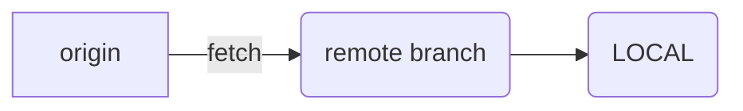

---
layout: single
title: "[Git]Git 협업"
tags:
  - git
---



git clone을 사용하면
메인 혹은 마스터 branch만 동기화 시킨다.
$ git clone

dev branch를 생성하고 checkout 받는다.
remote branch에서 내려 받는다.
checkout 할 때
$ git fetch origin을 하지 않으면 github 저장소와 동기화 되지 않을 수 있다.
$ git checkout -b dev origin/dev

최초로 데이터를 내려 받을때
git clone을 하는게 가장 편하다
git clone을 하게되면 main 혹은 master branch를 local에 가져오게 된다.
다른 branch가 필요하면 체크아웃 받으면서 branch를 생성한다.

git check out -b dev origin/main
깃 클론과 다르게
체크아웃 시 주의사항은 local에서 가져오는 것이 아니라 내 로컬pc 의 보이지 않는 remote branch에서 가져오기 때문에 fetch origin을 하지 않으면 github와 동기화 되지 않을 수 있다.
branch가 이미 있으면 fetch -> merge 해야한다. pull을 하면 두 작업이 한번에 된다.

## 혼자서 개발

- init commit (main)
- 환결설정 완료 (st)
- merge 완료
- 회원가입 완료 (join topic)
- merge 완료 (dev)

join topic에서 개발한 회원가입 완료를 dev에 merge를 그냥하면 패스트 포워드 merge가 되어 merge 로그가 남지 않는다.
merge 로그를 남기고 싶으면 `-no-ff` 옵션을 사용한다.
로그가 많으면 정리한다.

```
$ git rebase -i HEAD~2
$ git checkout dev
$ git merge --no-ff join_topic
:wq
```

혼자서 개발한다면 main branch에 dev를 merge 한다.

```
 $ git checkout main
 $ git merge --no-ff dev
```

main branch 에서 `--tags` 옵션을 줘야 github 저장소에 tag가 생긴다.
tag를 만들어줘야 코드도 내려받을 수 있다.

```
$ git tag blog1.0.0
$ git tag -n
$ git push --tags origin main
```

지속적으로 개발을 한다면 dev도 push를 해주는게 좋다.
topic은 push하지 않는게 좋다.

```
$ git push origin dev
```

## 소규모 협업하기

팀장이 github 저장소를 만들고 그대로 팀원들에게 그대로 주면 안되고 초기 셋팅을 해야 한다.
최초에만 `--all`을 사용하면 내가 지금 branch 어디에 있든 상관 없이 모든 브랜치가 저장소에 기록된다.

```
$ git add .
$ git commit -m "1. 환결설정 완료"

$ git checkout -b dev
$ git push --all
```

그런 다음 github 웹에서 repository - setting - Manage access 로 이동해서
Add people버튼을 클릭해서 팀원을 추가한다.

### bracnh 보호

아무나 push 할 수 없게 branch를 보호해야 한다.
settings - Branches로 가서 add rule을 클릭하여 추가한다.
Branch name pattern 입력 창에 main 브랜치를 입력 후 `Require a pull request before merging` 옵션을 체크 한다.
아무나 main 브랜치에 push 할 수 없게 된다.

똑같이 dev에 대한 rule을 하나 더 만들어 준다.

팀장이 만든 저장소에는 main 과 dev 두 개의 branch가 있다.

### 팀원

```
$ git clone (repo)
$ git log
```

로그를 확인해보니 HEAD->main이 존재하고 저장소에는 origin/main, origin/dev, origin/HEAD가 존재한다.

```
$ git branch
* main
```

clone을 했기 때문에 가상영역인 wapper branch에는 모두 fetch 되어있지만 작업영역에는 main barnch만 있다.

```
$ git checkout -b dev origin/dev
Switched to a new brach 'dev'
Branch 'dev' set up to track remote branch 'dev' from 'origin'
```

origin의 dev branch를 내 작업영역에 동기화를 시킨다.

```
$ git branch
* dev
  main
```

하지만 여기서 개발을 진행하면 안된다.
팀원이 local에서 잘못 push 할 수 있기 때문이다.
팀원들은 각자의 topic barnch 에서 작업을 해야 한다.

### topic barnch 생성

```
$ git checkout -b join_topic
Switched to a new branch 'join-topic'
```

join barnch를 생성 하고 작업을 진행한다.

```
$ git add .
$ git commit -m "회원가입 완료"
```

예시로 회원가입 완료를 commit 했다고 하자
본인의 local에서 dev로 merge를 해봤자 팀원들이 확인을 할 수 없다.

```
$ git push origin join-topic
```

origin에 push 하도록 하자
팀장님이 승인을 해줘야 push가 완료된다.

만약 topic branch에서 rebase 기능으로 commit을 정리했다면 강제로 push를 해야한다.

```
$ git push -f origin topic
```

주의할 점은 본인의 topic branch에만 rebase를 해야 한다.

### github pull request

github repository로 이동해서 상단의 `Pull requests` 버튼을 클릭하면 Compare changes 화면으로 이동하게 된다.

```
dev <- join_topic  ( Create pull request)
```

상단의 콤보박스에서 `dev`와 `join_topic`을 위와 같이 설정하고 `Create pull request` 버튼을 클릭하면 팀장님께 pull request 요청을 하게 된다.

### Notifications

팀장은 github repository에서 `Settings` 탭의 `Notifications`로 이동해서 `Address`에 email을 설정 해야한다.
팀원이 push하게 되면 메일을 확인할 수 있다.

### pull request 승인

github repo 상단의 `pull requests` 탭에서
`ㄹiles changed` 내역과 `Commits` 내역을 확인한다.

`Commits` 탭에서 `review changes` 버튼을 클릭한다.

Draft 초안이라면 `Comment`를 작성하고
`Approve` 버튼으로 승인하거나
`Request changes` 버튼을 클릭해서 거절할 수 있다.

승인하려면 `Approve`를 선택하고 `submit review` 버튼을 클릭한다.
다음 화면으로 이동하게 되면 `Merge pull request`를 클릭하여 merge를 할 수 있다.

승인이 되면 merge는 팀장이나 팀원이 할 수 있다.

### merge pull request

merge에는 세가지 방법이 있다

```
Create a merge commit
Squash and merge
Rebase and merge
```

그냥 merge 하게 되면 모든 commit 내역이 merge 된다. 가장 추천하는 방법이다.

보통 sqash는 추천하지 않고 rebase를 하게 된다면 애초에 topic branch에서 정리해서 pull request 하는 것이 좋다 .

### join_topic 제거

merge가 됐다면 팀원은 origin의 join_topic을 정리하면 된다.

```
$ git push --delete origin join_topic
```

로컬의 join_topic branch는 꼭 정리하지 않아도 된다.

### merge 된 dev brach pull

merge가 완료 되면 꼭 dev branch를 pull 하도록 하자
팀원의 local에는 merge 전 상태이기 때문이다.

```
$ git checkout dev
$ git pull origin dev
```

or

```
$ git fetch origin
```

pull을 하는것이 편하다 pull은 fetch와 merge가 합쳐진 작업이다.

### 요약

- (팀원) topic 브랜치 생성
- (팀원) 개발 완료
- (팀원) 로그 지저분하면 rebase
- (팀원) topic push
- (팀원) pr 요청
- (팀장) 승인 및 merge
- (팀원) merge 완료되면 github branch 정리
- (팀원) dev branch pull

### 대규모 협업 .머지 순서

체크아웃 먼저 한 순서대로 기록된다.
순서 변경하고 싶으면 rebase 해야한다.
